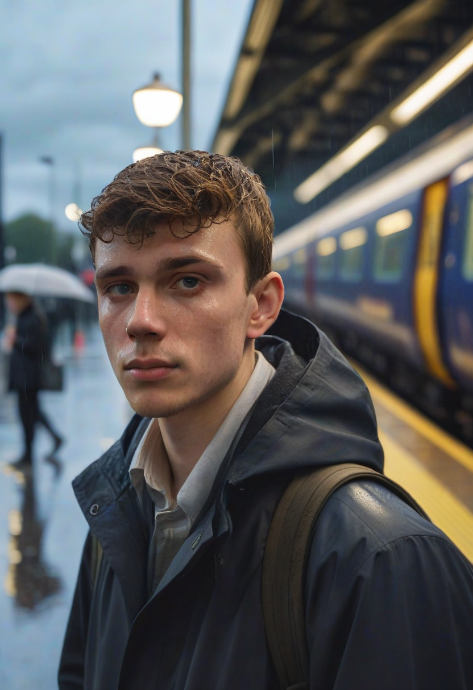

# Run 01 - txt2img_empty_latent (portrait_85mm)

## Command Executed

```bash
./venv/bin/python -m comfy_custom.cli sql remote --sql "SELECT image FROM txt2img_empty_latent USING default_run PROFILE portrait_85mm WHERE prompt='a candid cinematic portrait of a young man waiting at a rainy train platform in London at dusk, wet pavement reflections, soft volumetric light, realistic skin texture, natural color grading, 85mm photography, shallow depth of field' AND seed=114195 AND steps=18 AND filename_prefix='run01_txt2img_1775896090';"
```

## Download Command Used

```bash
curl -H "Authorization: Bearer <token>" "http://34.132.147.127:80/view?filename=run01_txt2img_1775896090_00001_.png&subfolder=&type=output" -o output/one_by_one/run01_txt2img_1775896090_00001_.png
```

## Output Image



## Notes

This run uses `portrait_85mm` at 18 steps for a high-quality cinematic portrait look with realistic skin texture.
The scene composition and background mood are strong, with good depth separation and natural lighting balance.
