# txt2img_all_combs

Prompt used for all runs:

```
a cinematic documentary-style portrait of a person standing in a lively city square at blue hour, natural skin texture, realistic lighting, detailed environment, shallow depth of field, high-end photography
```

Seed: `314159`  
Steps: `18`

## cinematic_portrait_lens_50mm

```sql
SELECT image FROM txt2img_empty_latent USING default_run PROFILE cinematic_portrait_lens_50mm WHERE prompt='a cinematic documentary-style portrait of a person standing in a lively city square at blue hour, natural skin texture, realistic lighting, detailed environment, shallow depth of field, high-end photography' AND seed=314159 AND steps=18 AND filename_prefix='comb_cinematic_portrait_lens_50mm_1775896535';
```

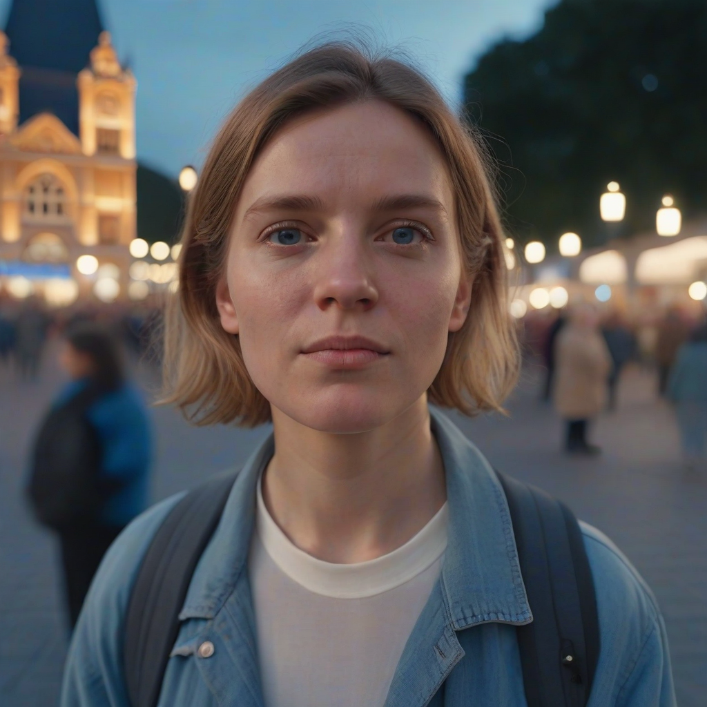

Run completed successfully with the shared prompt and profile-specific framing/style controls.
This output is useful for comparing how each profile changes composition, lens feel, and aspect behavior.

## closeup_soft_light

```sql
SELECT image FROM txt2img_empty_latent USING default_run PROFILE closeup_soft_light WHERE prompt='a cinematic documentary-style portrait of a person standing in a lively city square at blue hour, natural skin texture, realistic lighting, detailed environment, shallow depth of field, high-end photography' AND seed=314159 AND steps=18 AND filename_prefix='comb_closeup_soft_light_1775896560';
```


Run completed successfully with the shared prompt and profile-specific framing/style controls.
This output is useful for comparing how each profile changes composition, lens feel, and aspect behavior.

## dramatic_low_angle

```sql
SELECT image FROM txt2img_empty_latent USING default_run PROFILE dramatic_low_angle WHERE prompt='a cinematic documentary-style portrait of a person standing in a lively city square at blue hour, natural skin texture, realistic lighting, detailed environment, shallow depth of field, high-end photography' AND seed=314159 AND steps=18 AND filename_prefix='comb_dramatic_low_angle_1775896585';
```

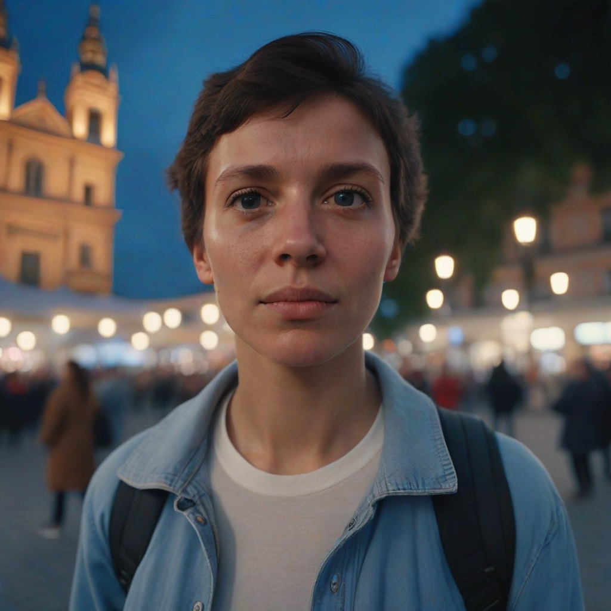

Run completed successfully with the shared prompt and profile-specific framing/style controls.
This output is useful for comparing how each profile changes composition, lens feel, and aspect behavior.

## goldenhour_backlight

```sql
SELECT image FROM txt2img_empty_latent USING default_run PROFILE goldenhour_backlight WHERE prompt='a cinematic documentary-style portrait of a person standing in a lively city square at blue hour, natural skin texture, realistic lighting, detailed environment, shallow depth of field, high-end photography' AND seed=314159 AND steps=18 AND filename_prefix='comb_goldenhour_backlight_1775896611';
```

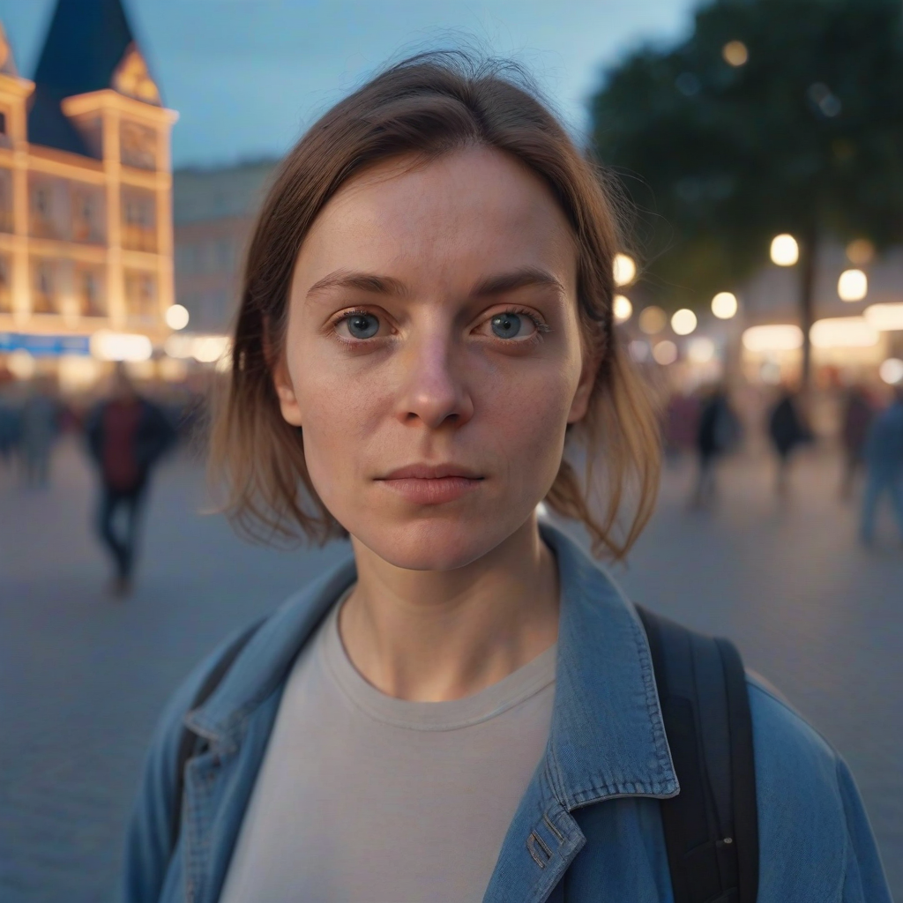

Run completed successfully with the shared prompt and profile-specific framing/style controls.
This output is useful for comparing how each profile changes composition, lens feel, and aspect behavior.

## hd_1080p

```sql
SELECT image FROM txt2img_empty_latent USING default_run PROFILE hd_1080p WHERE prompt='a cinematic documentary-style portrait of a person standing in a lively city square at blue hour, natural skin texture, realistic lighting, detailed environment, shallow depth of field, high-end photography' AND seed=314159 AND steps=18 AND filename_prefix='comb_hd_1080p_1775896637';
```

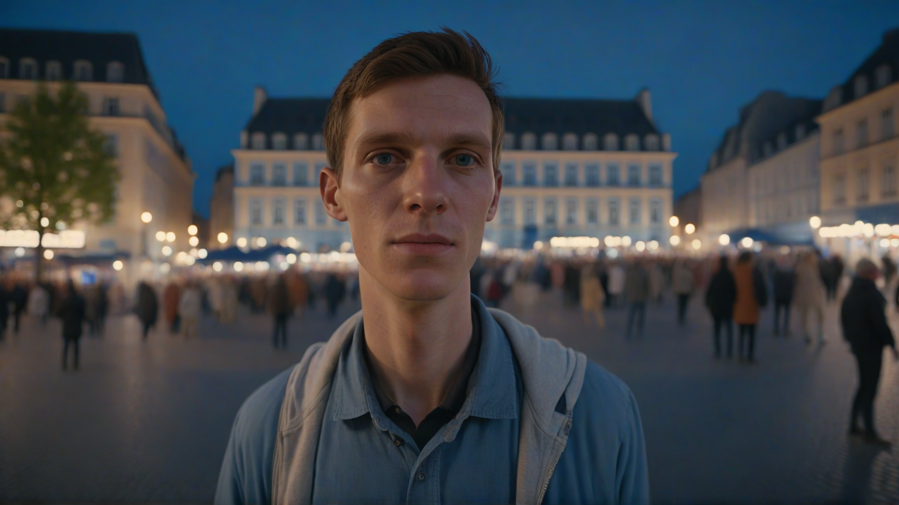

Run completed successfully with the shared prompt and profile-specific framing/style controls.
This output is useful for comparing how each profile changes composition, lens feel, and aspect behavior.

## hd_720p

```sql
SELECT image FROM txt2img_empty_latent USING default_run PROFILE hd_720p WHERE prompt='a cinematic documentary-style portrait of a person standing in a lively city square at blue hour, natural skin texture, realistic lighting, detailed environment, shallow depth of field, high-end photography' AND seed=314159 AND steps=18 AND filename_prefix='comb_hd_720p_1775896689';
```

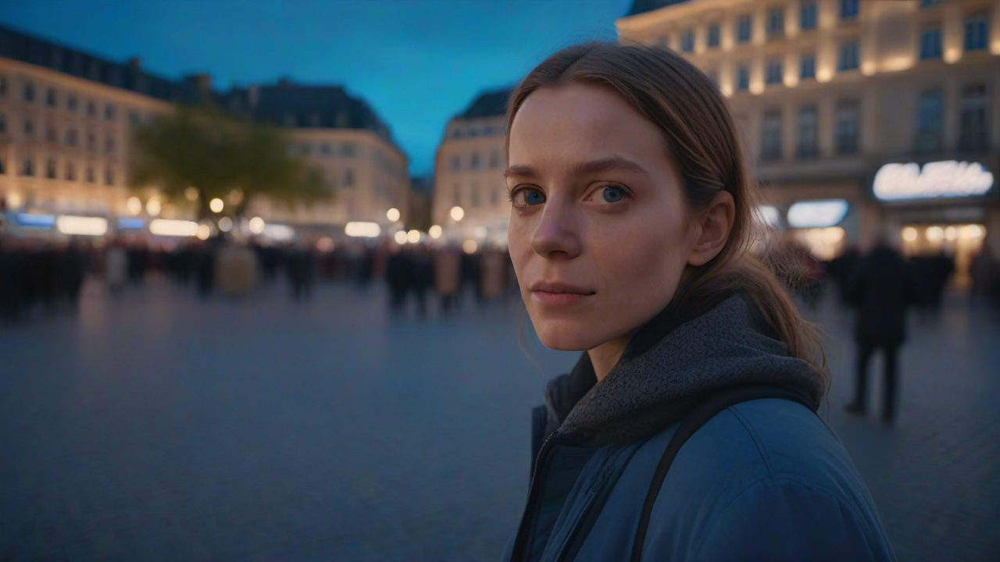

Run completed successfully with the shared prompt and profile-specific framing/style controls.
This output is useful for comparing how each profile changes composition, lens feel, and aspect behavior.

## high_angle_overcast

```sql
SELECT image FROM txt2img_empty_latent USING default_run PROFILE high_angle_overcast WHERE prompt='a cinematic documentary-style portrait of a person standing in a lively city square at blue hour, natural skin texture, realistic lighting, detailed environment, shallow depth of field, high-end photography' AND seed=314159 AND steps=18 AND filename_prefix='comb_high_angle_overcast_1775896713';
```

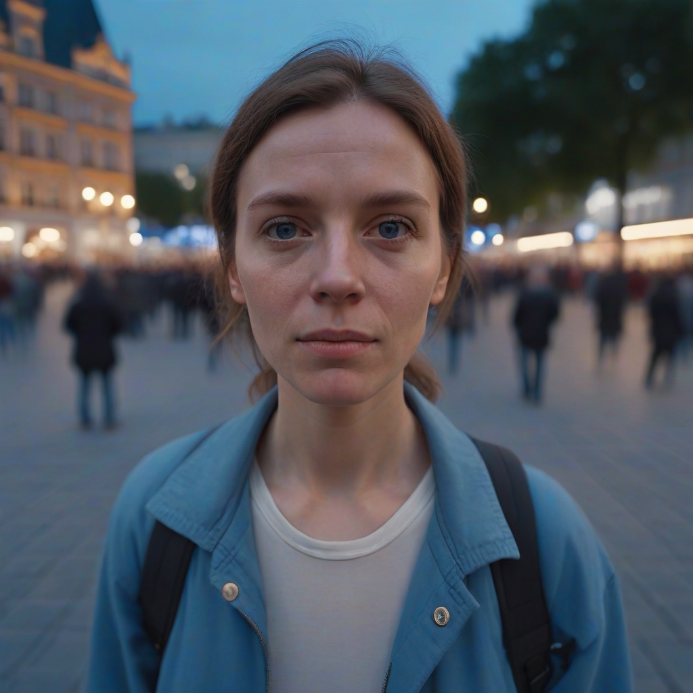

Run completed successfully with the shared prompt and profile-specific framing/style controls.
This output is useful for comparing how each profile changes composition, lens feel, and aspect behavior.

## landscape_16x9

```sql
SELECT image FROM txt2img_empty_latent USING default_run PROFILE landscape_16x9 WHERE prompt='a cinematic documentary-style portrait of a person standing in a lively city square at blue hour, natural skin texture, realistic lighting, detailed environment, shallow depth of field, high-end photography' AND seed=314159 AND steps=18 AND filename_prefix='comb_landscape_16x9_1775896739';
```


Run completed successfully with the shared prompt and profile-specific framing/style controls.
This output is useful for comparing how each profile changes composition, lens feel, and aspect behavior.

## landscape_3x2

```sql
SELECT image FROM txt2img_empty_latent USING default_run PROFILE landscape_3x2 WHERE prompt='a cinematic documentary-style portrait of a person standing in a lively city square at blue hour, natural skin texture, realistic lighting, detailed environment, shallow depth of field, high-end photography' AND seed=314159 AND steps=18 AND filename_prefix='comb_landscape_3x2_1775896790';
```

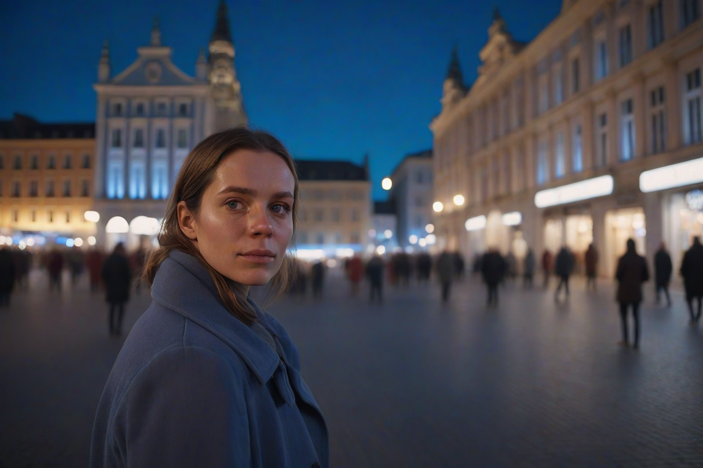

Run completed successfully with the shared prompt and profile-specific framing/style controls.
This output is useful for comparing how each profile changes composition, lens feel, and aspect behavior.

## lens_50mm

```sql
SELECT image FROM txt2img_empty_latent USING default_run PROFILE lens_50mm WHERE prompt='a cinematic documentary-style portrait of a person standing in a lively city square at blue hour, natural skin texture, realistic lighting, detailed environment, shallow depth of field, high-end photography' AND seed=314159 AND steps=18 AND filename_prefix='comb_lens_50mm_1775896830';
```

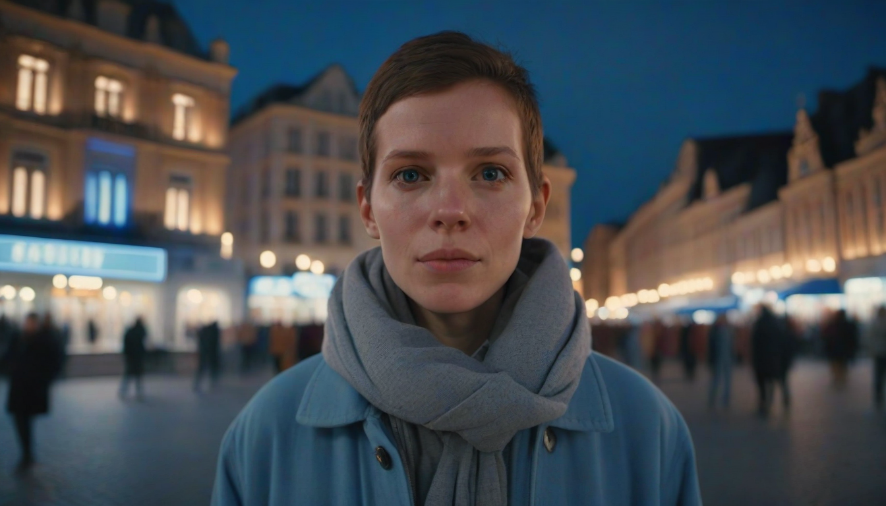

Run completed successfully with the shared prompt and profile-specific framing/style controls.
This output is useful for comparing how each profile changes composition, lens feel, and aspect behavior.

## mediumshot_natural

```sql
SELECT image FROM txt2img_empty_latent USING default_run PROFILE mediumshot_natural WHERE prompt='a cinematic documentary-style portrait of a person standing in a lively city square at blue hour, natural skin texture, realistic lighting, detailed environment, shallow depth of field, high-end photography' AND seed=314159 AND steps=18 AND filename_prefix='comb_mediumshot_natural_1775896857';
```

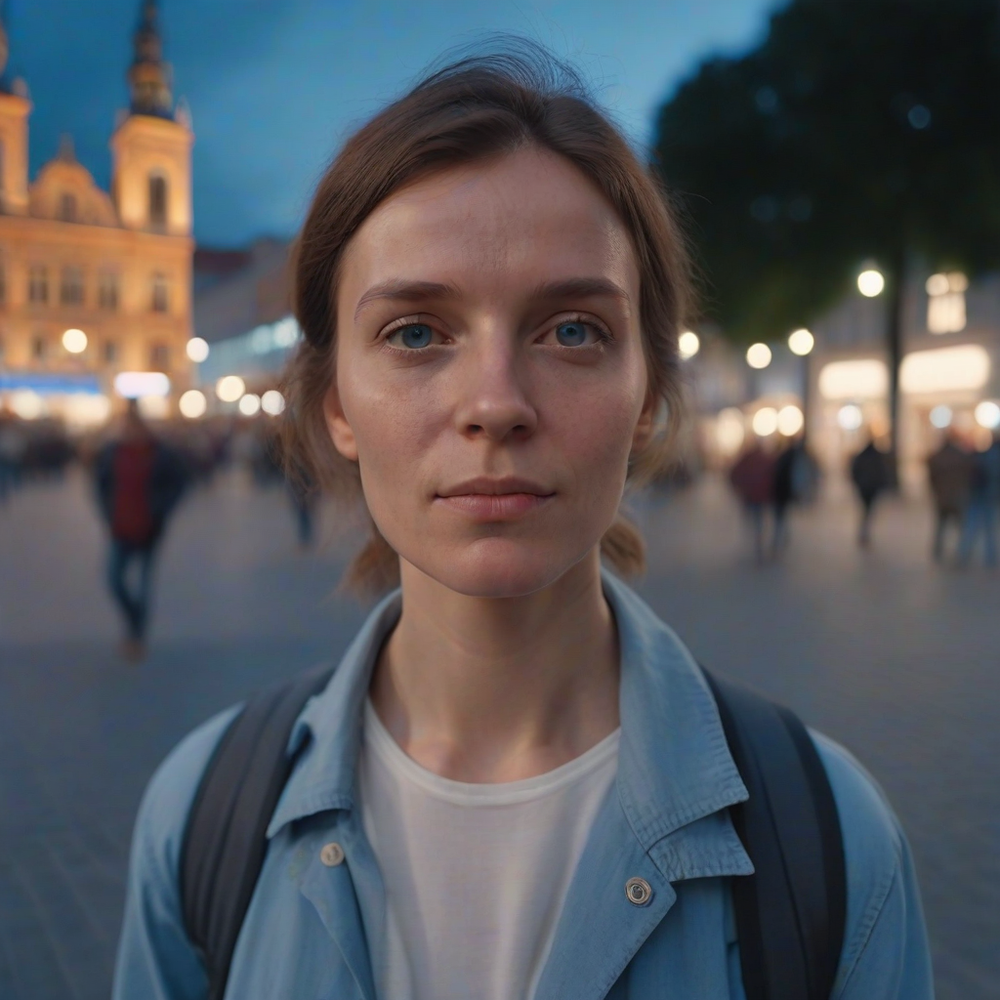

Run completed successfully with the shared prompt and profile-specific framing/style controls.
This output is useful for comparing how each profile changes composition, lens feel, and aspect behavior.

## natural_35mm

```sql
SELECT image FROM txt2img_empty_latent USING default_run PROFILE natural_35mm WHERE prompt='a cinematic documentary-style portrait of a person standing in a lively city square at blue hour, natural skin texture, realistic lighting, detailed environment, shallow depth of field, high-end photography' AND seed=314159 AND steps=18 AND filename_prefix='comb_natural_35mm_1775896883';
```

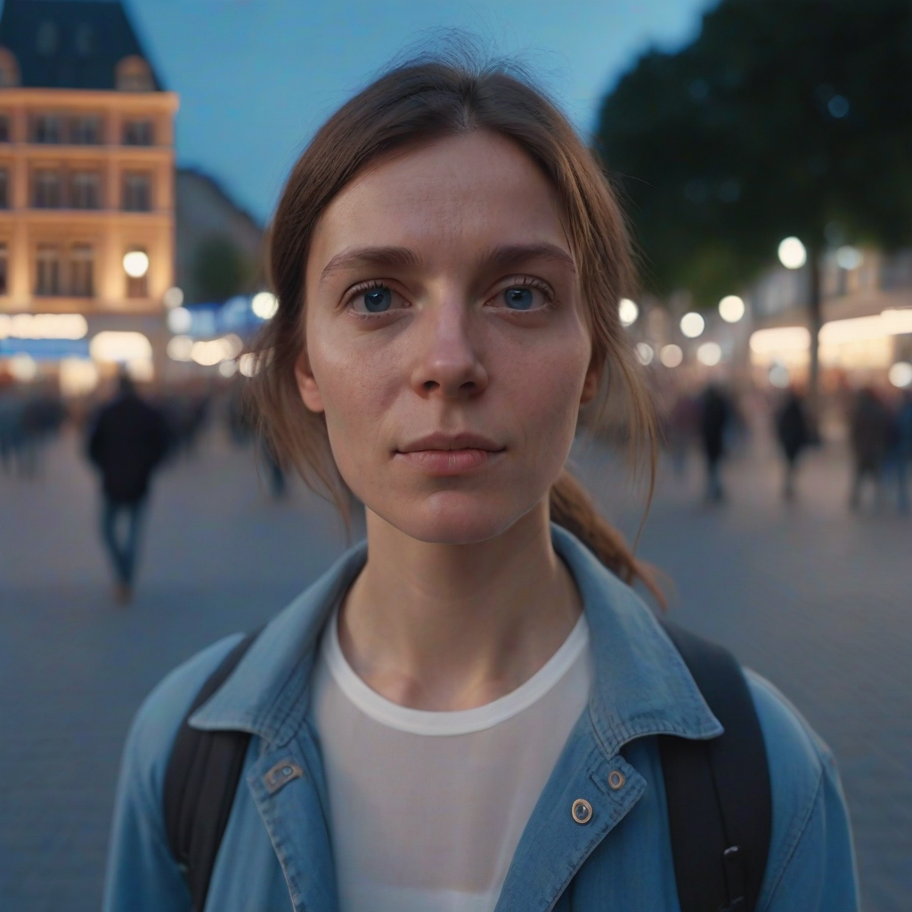

Run completed successfully with the shared prompt and profile-specific framing/style controls.
This output is useful for comparing how each profile changes composition, lens feel, and aspect behavior.

## portrait_2x3

```sql
SELECT image FROM txt2img_empty_latent USING default_run PROFILE portrait_2x3 WHERE prompt='a cinematic documentary-style portrait of a person standing in a lively city square at blue hour, natural skin texture, realistic lighting, detailed environment, shallow depth of field, high-end photography' AND seed=314159 AND steps=18 AND filename_prefix='comb_portrait_2x3_1775896909';
```

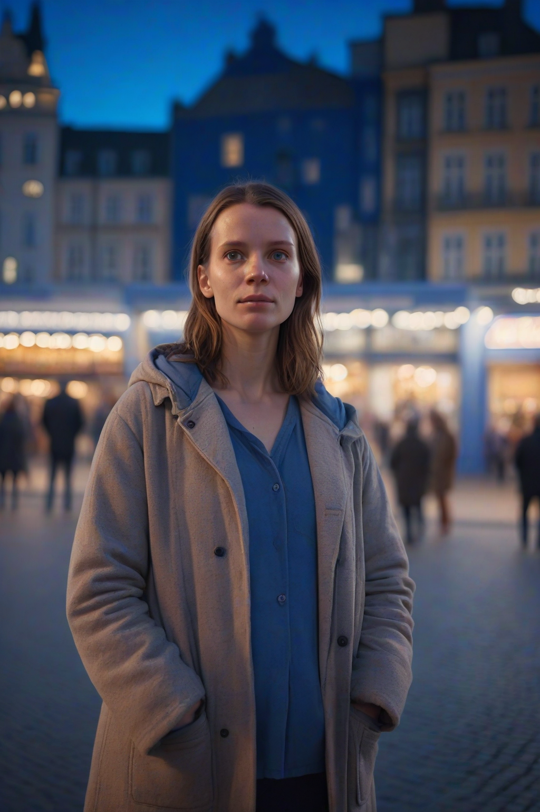

Run completed successfully with the shared prompt and profile-specific framing/style controls.
This output is useful for comparing how each profile changes composition, lens feel, and aspect behavior.

## portrait_4x5

```sql
SELECT image FROM txt2img_empty_latent USING default_run PROFILE portrait_4x5 WHERE prompt='a cinematic documentary-style portrait of a person standing in a lively city square at blue hour, natural skin texture, realistic lighting, detailed environment, shallow depth of field, high-end photography' AND seed=314159 AND steps=18 AND filename_prefix='comb_portrait_4x5_1775896948';
```

Failed after profile fix+retry.

```text
[comfy-agent] using remote server http://34.132.147.127:80 upload_preflight uploaded=0 skipped_existing=0 failed=0 validation_failed: Node '5' input 'height' must be a positive integer multiple of 8. [comfy-agent] using remote server http://34.132.147.127:80 upload_preflight uploaded=0 skipped_existing=0 failed=0 validation_failed: Node '5' input 'height' must be a positive integer multiple of 8. 
```

## portrait_85mm

```sql
SELECT image FROM txt2img_empty_latent USING default_run PROFILE portrait_85mm WHERE prompt='a cinematic documentary-style portrait of a person standing in a lively city square at blue hour, natural skin texture, realistic lighting, detailed environment, shallow depth of field, high-end photography' AND seed=314159 AND steps=18 AND filename_prefix='comb_portrait_85mm_1775896952';
```

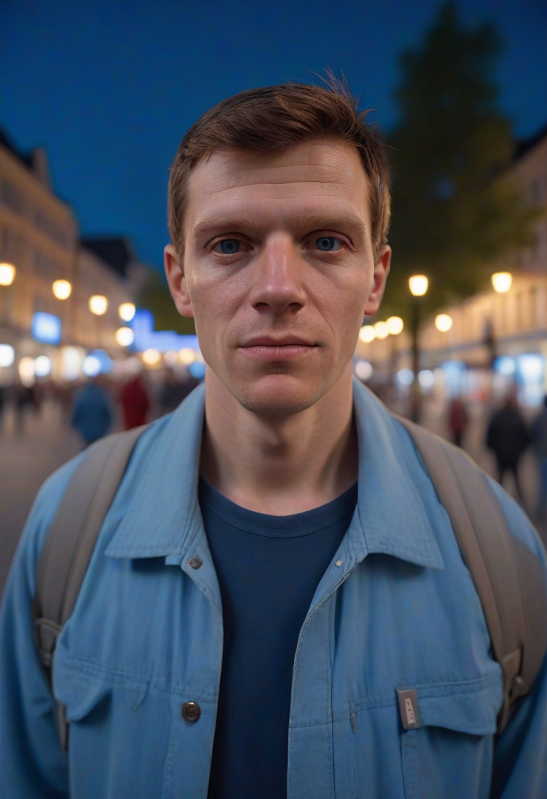

Run completed successfully with the shared prompt and profile-specific framing/style controls.
This output is useful for comparing how each profile changes composition, lens feel, and aspect behavior.

## print_a4_landscape

```sql
SELECT image FROM txt2img_empty_latent USING default_run PROFILE print_a4_landscape WHERE prompt='a cinematic documentary-style portrait of a person standing in a lively city square at blue hour, natural skin texture, realistic lighting, detailed environment, shallow depth of field, high-end photography' AND seed=314159 AND steps=18 AND filename_prefix='comb_print_a4_landscape_1775896979';
```

Failed after profile fix+retry.

```text
[comfy-agent] using remote server http://34.132.147.127:80 upload_preflight uploaded=0 skipped_existing=0 failed=0 validation_failed: Node '5' input 'width' must be a positive integer multiple of 8. [comfy-agent] using remote server http://34.132.147.127:80 upload_preflight uploaded=0 skipped_existing=0 failed=0 validation_failed: Node '5' input 'width' must be a positive integer multiple of 8. 
```

## print_a4_portrait

```sql
SELECT image FROM txt2img_empty_latent USING default_run PROFILE print_a4_portrait WHERE prompt='a cinematic documentary-style portrait of a person standing in a lively city square at blue hour, natural skin texture, realistic lighting, detailed environment, shallow depth of field, high-end photography' AND seed=314159 AND steps=18 AND filename_prefix='comb_print_a4_portrait_1775896983';
```

Failed after profile fix+retry.

```text
[comfy-agent] using remote server http://34.132.147.127:80 upload_preflight uploaded=0 skipped_existing=0 failed=0 validation_failed: Node '5' input 'height' must be a positive integer multiple of 8. [comfy-agent] using remote server http://34.132.147.127:80 upload_preflight uploaded=0 skipped_existing=0 failed=0 validation_failed: Node '5' input 'height' must be a positive integer multiple of 8. 
```

## reel_9x16

```sql
SELECT image FROM txt2img_empty_latent USING default_run PROFILE reel_9x16 WHERE prompt='a cinematic documentary-style portrait of a person standing in a lively city square at blue hour, natural skin texture, realistic lighting, detailed environment, shallow depth of field, high-end photography' AND seed=314159 AND steps=18 AND filename_prefix='comb_reel_9x16_1775896987';
```

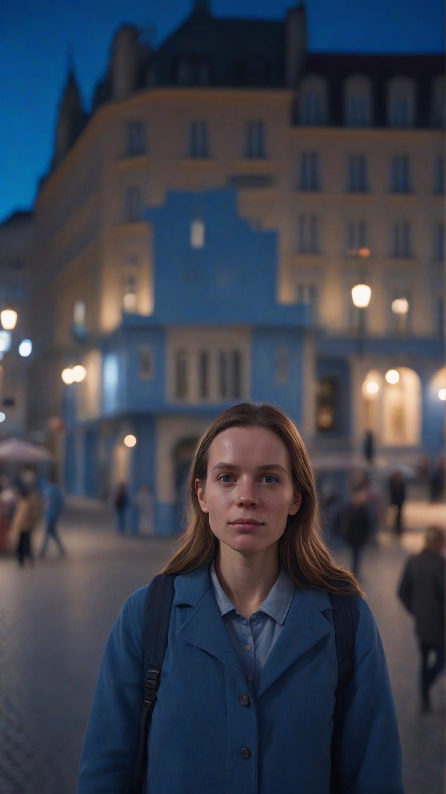

Run completed successfully with the shared prompt and profile-specific framing/style controls.
This output is useful for comparing how each profile changes composition, lens feel, and aspect behavior.

## square_1024

```sql
SELECT image FROM txt2img_empty_latent USING default_run PROFILE square_1024 WHERE prompt='a cinematic documentary-style portrait of a person standing in a lively city square at blue hour, natural skin texture, realistic lighting, detailed environment, shallow depth of field, high-end photography' AND seed=314159 AND steps=18 AND filename_prefix='comb_square_1024_1775897038';
```

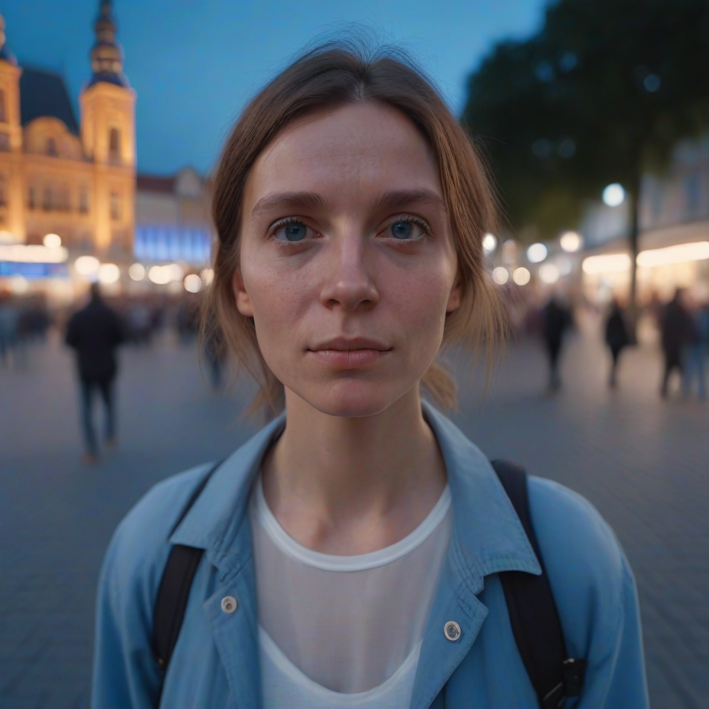

Run completed successfully with the shared prompt and profile-specific framing/style controls.
This output is useful for comparing how each profile changes composition, lens feel, and aspect behavior.

## square_1x1

```sql
SELECT image FROM txt2img_empty_latent USING default_run PROFILE square_1x1 WHERE prompt='a cinematic documentary-style portrait of a person standing in a lively city square at blue hour, natural skin texture, realistic lighting, detailed environment, shallow depth of field, high-end photography' AND seed=314159 AND steps=18 AND filename_prefix='comb_square_1x1_1775897064';
```


Run completed successfully with the shared prompt and profile-specific framing/style controls.
This output is useful for comparing how each profile changes composition, lens feel, and aspect behavior.

## standard_50mm

```sql
SELECT image FROM txt2img_empty_latent USING default_run PROFILE standard_50mm WHERE prompt='a cinematic documentary-style portrait of a person standing in a lively city square at blue hour, natural skin texture, realistic lighting, detailed environment, shallow depth of field, high-end photography' AND seed=314159 AND steps=18 AND filename_prefix='comb_standard_50mm_1775897094';
```

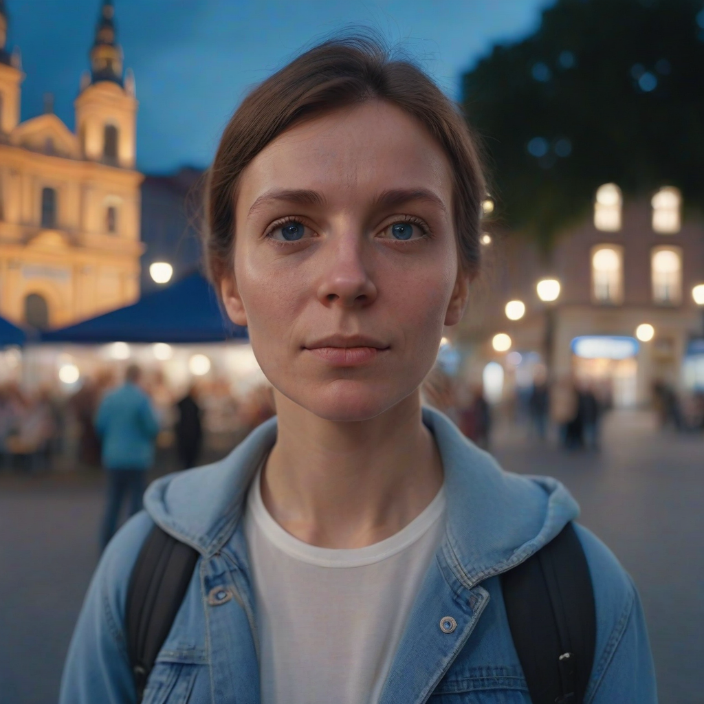

Run completed successfully with the shared prompt and profile-specific framing/style controls.
This output is useful for comparing how each profile changes composition, lens feel, and aspect behavior.

## story_9x16

```sql
SELECT image FROM txt2img_empty_latent USING default_run PROFILE story_9x16 WHERE prompt='a cinematic documentary-style portrait of a person standing in a lively city square at blue hour, natural skin texture, realistic lighting, detailed environment, shallow depth of field, high-end photography' AND seed=314159 AND steps=18 AND filename_prefix='comb_story_9x16_1775897121';
```


Run completed successfully with the shared prompt and profile-specific framing/style controls.
This output is useful for comparing how each profile changes composition, lens feel, and aspect behavior.

## studio_hard_side

```sql
SELECT image FROM txt2img_empty_latent USING default_run PROFILE studio_hard_side WHERE prompt='a cinematic documentary-style portrait of a person standing in a lively city square at blue hour, natural skin texture, realistic lighting, detailed environment, shallow depth of field, high-end photography' AND seed=314159 AND steps=18 AND filename_prefix='comb_studio_hard_side_1775897172';
```


Run completed successfully with the shared prompt and profile-specific framing/style controls.
This output is useful for comparing how each profile changes composition, lens feel, and aspect behavior.

## vertical_9x16

```sql
SELECT image FROM txt2img_empty_latent USING default_run PROFILE vertical_9x16 WHERE prompt='a cinematic documentary-style portrait of a person standing in a lively city square at blue hour, natural skin texture, realistic lighting, detailed environment, shallow depth of field, high-end photography' AND seed=314159 AND steps=18 AND filename_prefix='comb_vertical_9x16_1775897199';
```


Run completed successfully with the shared prompt and profile-specific framing/style controls.
This output is useful for comparing how each profile changes composition, lens feel, and aspect behavior.

## wide_21x9

```sql
SELECT image FROM txt2img_empty_latent USING default_run PROFILE wide_21x9 WHERE prompt='a cinematic documentary-style portrait of a person standing in a lively city square at blue hour, natural skin texture, realistic lighting, detailed environment, shallow depth of field, high-end photography' AND seed=314159 AND steps=18 AND filename_prefix='comb_wide_21x9_1775897251';
```

Failed after profile fix+retry.

```text
[comfy-agent] using remote server http://34.132.147.127:80 upload_preflight uploaded=0 skipped_existing=0 failed=0 validation_failed: Node '5' input 'height' must be a positive integer multiple of 8. [comfy-agent] using remote server http://34.132.147.127:80 upload_preflight uploaded=0 skipped_existing=0 failed=0 validation_failed: Node '5' input 'height' must be a positive integer multiple of 8. 
```

## wide_24mm

```sql
SELECT image FROM txt2img_empty_latent USING default_run PROFILE wide_24mm WHERE prompt='a cinematic documentary-style portrait of a person standing in a lively city square at blue hour, natural skin texture, realistic lighting, detailed environment, shallow depth of field, high-end photography' AND seed=314159 AND steps=18 AND filename_prefix='comb_wide_24mm_1775897254';
```

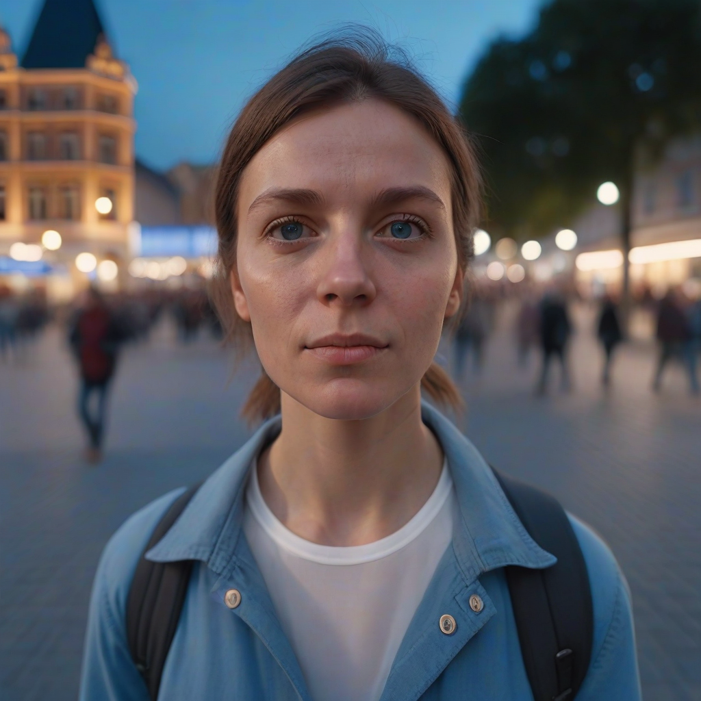

Run completed successfully with the shared prompt and profile-specific framing/style controls.
This output is useful for comparing how each profile changes composition, lens feel, and aspect behavior.

